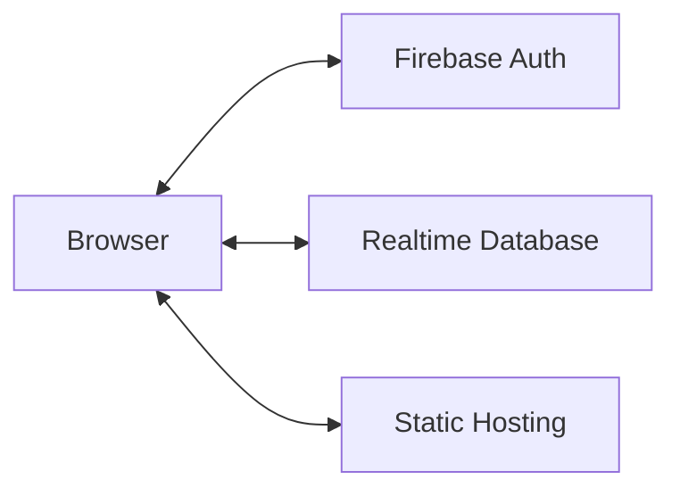

# 🚀 Deployment Plan

MentorMatch is a static Single Page Application (SPA). There is no backend server to manage — all data, authentication, and real-time updates are handled directly by the browser via Firebase.

## 🏗 Architecture Overview



---

## ✅ Recommended: Vercel (Easiest)

Vercel provides the best developer experience with automated CI/CD and atomic deployments.

### 1. Push to GitHub
```bash
git init
git add .
git commit -m "feat: Initial implementation"
# Create repository on GitHub, then:
git remote add origin https://github.com/YOUR_USERNAME/mentor-match.git
git push -u origin main
```

### 2. Import on Vercel
1. Connect your GitHub account to [Vercel](https://vercel.com).
2. Select the `mentor-match` project.
3. Vercel will auto-detect the Vite framework.
4. Add your Firebase environment variables in the project settings if using a `.env` file.
5. Click **Deploy**.

### 3. Handle SPA Refresh
Ensure `vercel.json` is in your root directory to handle deep-linking:
```json
{
  "rewrites": [{ "source": "/(.*)", "destination": "/index.html" }]
}
```

---

## ⚡ Alternative: Firebase Hosting

```bash
npm install -g firebase-tools
firebase login
firebase init hosting
# Select: dist (build folder) | Single-page app: Yes
npm run build
firebase deploy
```

---

## 🔒 Security Hardening

Before moving to production, you **must** apply the security rules found in `REALTIME_DATABASE_RULES.json`. These rules ensure that:
- Users can only edit their own profiles.
- Private chats are only readable by the participants.
- Match requests cannot be forged.

**Deploying Rules:**
```bash
firebase deploy --only database
```

---

## 🚀 Launch Checklist

- [ ] Replaced developer `console.log` with production-safe logger.
- [ ] Hardened Firebase Realtime Database rules.
- [ ] Authorized the production domain in the Firebase Console (Auth → Settings).
- [ ] Verified the "Match Deck" and "Messaging" flows in the built environment.
- [ ] Set up a `.env` template for other developers.
